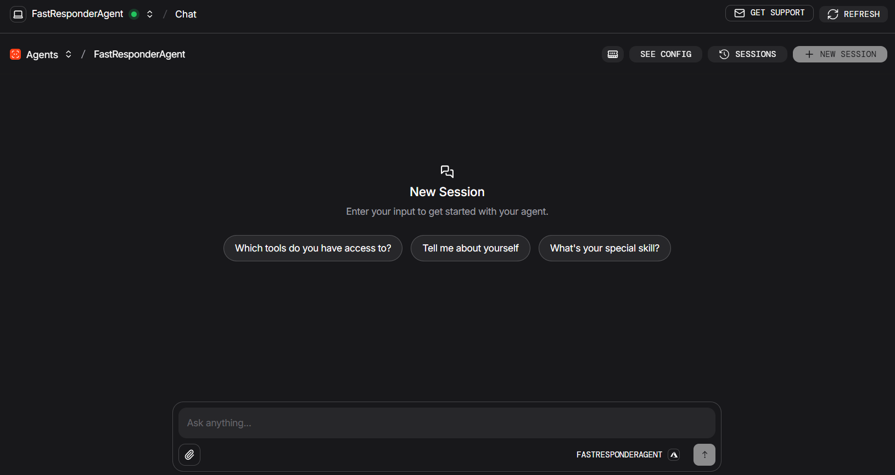

# Agentic AI for Vietnam Stock

> A multi-agent system for querying Vietnamese stock symbols, retrieving real-time market data, and predicting next-day opening prices using AI reasoning.

[](https://www.python.org/)
[](LICENSE)
[](https://www.docker.com/)



---

## Features

- **1,500+ Stock Symbols** — Full coverage of Vietnamese stock market tickers
- **Real-Time Market Data** — Retrieve floor price, ceiling price, opening price, closing price, and trading volume
- **Company Information** — Access general stock and company profiles
- **Next-Day Price Prediction** — AI-driven prediction of the next day's opening price based on the latest market data

---

## Configuration

All options are configurable via `.env`.

### LLM Backends

| Provider | Notes |
|---|---|
| **Azure OpenAI** | Recommended |
| OpenAI | Fully supported |
| Gemini | Fully supported |
| Hugging Face | Fully supported |

> **Note:** Most LLMs do not expose a native reasoning interface. A *tool-based thinking* technique is used as a drop-in replacement, achieving comparable performance.

### Database Backends

| Database | Notes |
|---|---|
| MongoDB | Fully supported |
| **SQLite** | Recommended |
| JSON | Lightweight option |
| In-Memory | For ephemeral/testing use |

---

## Installation

Choose one of the following methods:

1. [Manual Installation](#manual-installation)
2. [Docker (Recommended)](#docker-recommended)

---

### Manual Installation

#### 1. Clone the Repository

```bash
git clone https://github.com/tohoangminhtien/StockAiAgent
cd StockAiAgent
```

#### 2. Install Dependencies

This project recommends using [`uv`](https://github.com/astral-sh/uv) for environment and dependency management.

```bash
uv venv
```

Activate the virtual environment:

```bash
# Windows
.venv\Scripts\activate

# Linux / macOS
source .venv/bin/activate
```

Install dependencies:

```bash
uv pip install -r requirements.txt
```

#### 3. Start the Backend Server

```bash
uv run app.py
```

Expected output:

```
INFO:     Uvicorn running on http://localhost:7777 (Press CTRL+C to quit)
INFO:     Started reloader process [14532] using WatchFiles
INFO:     Started server process [22516]
INFO:     Waiting for application startup.
INFO:     Application startup complete.
```

The server will start listening on port `7777`.

#### 4. Connect the Frontend

This project uses [AgnoOS](https://os.agno.com/) as the UI layer.

1. Log in to [AgnoOS](https://os.agno.com/)
2. Select **Connect your AgentOS**
3. Enter the endpoint URL: `localhost:7777`
4. Set the agent **Name** to: `FastResponderAgent`

Your credentials are saved after the first connection — no re-entry required on subsequent sessions.


---

### Docker (Recommended)

> Docker setup documentation is in progress. Check back for updates.

---

## License

This project is licensed under the [MIT License](LICENSE).
